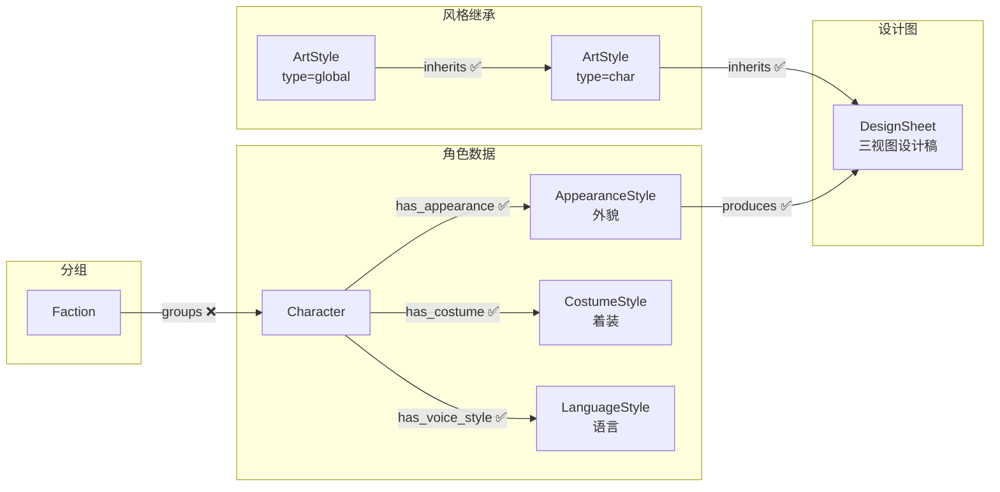
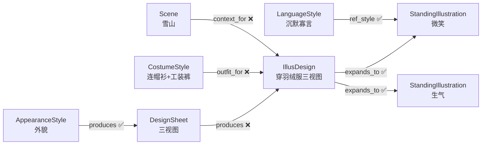

# 02 角色美术

> 角色从文字到画面的完整生产链：风格继承 → 外貌/着装数据 → 三视图设计稿 → 立绘设计图 → 立绘变体。

---

## 风格继承链

```
ArtStyle[global] → inherits → ArtStyle[char] → inherits → DesignSheet
```

---

## 节点

### 美术风格（ArtStyle）

通过 `type` 区分角色/场景分支。所有风格内容写入 `description`，通过 inherits 边形成继承链。

| 字段 | 中文 | 类型 | 必填 | 说明 |
|------|------|------|------|------|
| id | 编号 | string | 是 | `style_001` |
| name | 名称 | string | 是 | |
| type | 类型 | enum | 是 | `global` / `char` / `scene` |
| description | 描述 | string | 否 | 所有风格内容（画风、头身比、渲染风格、设计图/立绘规格等） |

**type 枚举**：
- `global`：全局基础风格（渲染风格等），恰好 1 个
- `char`：角色分支风格（画风、头身比、设计图/立绘规格等），恰好 1 个
- `scene`：场景分支风格（画风、光线、设计图/立绘规格等），恰好 1 个（详见 [03_场景美术.md](03_场景美术.md)）

---

### 语言风格（LanguageStyle）

每个角色一个。定义角色的说话方式、语气、口头禅等。立绘的表情和动作参考语言风格生成。

| 字段 | 中文 | 类型 | 必填 | 说明 |
|------|------|------|------|------|
| id | 编号 | string | 是 | `voice_001` |
| name | 名称 | string | 是 | `陆择语言风格` |
| path | 文件路径 | string | 否 | `05_角色设计/char/char_001/语言风格.md` |
| description | 描述 | string | 否 | 语言风格概要（语气、口头禅、典型表达等） |
| status | 流程状态 | int | 否 | `0` |

**status 枚举**：`0` 待设计 → `1` 已完成

---

### 外貌特征（AppearanceStyle）

每个角色一个。定义角色的固定外貌（脸、体型、发色、瞳色等）。纯数据节点，不参与风格继承。

| 字段 | 中文 | 类型 | 必填 | 说明 |
|------|------|------|------|------|
| id | 编号 | string | 是 | `appearance_001` |
| name | 名称 | string | 是 | `陆择外貌特征` |
| appearance | 外貌描述 | string | 否 | `182cm, 黑色短发, 琥珀色瞳, 偏瘦` |
| color_direction | 主色调 | string | 否 | `深蓝+银灰`（发色、瞳色、肤色相关） |
| shape_language | 形状语言 | string | 否 | 几何形态倾向 |
| visual_tone | 视觉气质 | string | 否 | 氛围/气质描述 |
| first_impression | 第一印象 | string | 否 | |
| memory_points | 记忆点 | string | 否 | |
| status | 流程状态 | int | 否 | `0` |

**status 枚举**：`0` 待设计 → `1` 已完成

---

### 着装特征（CostumeStyle）

每个角色一个。定义角色的默认着装（衣物、配饰、材质等）。纯数据节点，不参与风格继承。立绘设计图会根据场景对默认着装进行适配。

| 字段 | 中文 | 类型 | 必填 | 说明 |
|------|------|------|------|------|
| id | 编号 | string | 是 | `costume_001` |
| name | 名称 | string | 是 | `陆择着装特征` |
| default_outfit | 默认着装 | string | 否 | `黑色连帽衫, 工装裤, 运动鞋` |
| material_direction | 材质方向 | string | 否 | 材质/纹理指引 |
| posture | 体态气质 | string | 否 | 体态/肢体语言 |
| accessories | 配饰 | string | 否 | `银色项链, 左耳钉` |
| status | 流程状态 | int | 否 | `0` |

**status 枚举**：`0` 待设计 → `1` 已完成

---

### 设计图（DesignSheet）

每个角色一个。角色的三视图设计稿。继承 type=char 的 ArtStyle，决定渲染方式、头身比等。

| 字段 | 中文 | 类型 | 必填 | 说明 |
|------|------|------|------|------|
| id | 编号 | string | 是 | `design_001` |
| prompt_path | 提示词路径 | string | 否 | `06_角色美术/char_001/设计图提示词.md` |
| image_path | 图片路径 | string | 否 | `06_角色美术/char_001/设计图.png` |
| status | 流程状态 | int | 否 | `0` |

**status 枚举**：`0` 待生成 → `1` 提示词完成 → `2` 图片生成完成

---

### 立绘设计图（IllusDesign）

每个 (DesignSheet, Scene) 组合一个。角色在特定场景中的适配三视图设计稿——由设计图（外貌基础）、着装特征（默认着装）和场景（环境上下文）共同决定。

| 字段 | 中文 | 类型 | 必填 | 说明 |
|------|------|------|------|------|
| id | 编号 | string | 是 | `illus_001` |
| prompt_path | 提示词路径 | string | 否 | `06_角色美术/char_001/立绘设计/scene_003/提示词.md` |
| image_path | 图片路径 | string | 否 | `06_角色美术/char_001/立绘设计/scene_003/设计图.png` |
| adaptation_notes | 适配说明 | string | 否 | `穿着羽绒服、围巾、手套` |
| status | 流程状态 | int | 否 | `0` |

**status 枚举**：`0` 待生成 → `1` 提示词完成 → `2` 图片生成完成

---

### 立绘（StandingIllustration）

从立绘设计图拓展出的具体变体——不同表情、动作的单张立绘。每张独立节点。表情和动作参考角色的 LanguageStyle 生成。

| 字段 | 中文 | 类型 | 必填 | 说明 |
|------|------|------|------|------|
| id | 编号 | string | 是 | `stand_001` |
| variant_label | 变体标签 | string | 是 | `微笑` / `生气` / `行走` / `待机` |
| prompt_path | 提示词路径 | string | 否 | `06_角色美术/char_001/立绘/scene_003/微笑/提示词.md` |
| image_path | 图片路径 | string | 否 | `06_角色美术/char_001/立绘/scene_003/微笑/立绘.png` |
| status | 流程状态 | int | 否 | `0` |

**status 枚举**：`0` 待生成 → `1` 提示词完成 → `2` 图片生成完成

---

### 阵营（Faction）— 按需

> 非必须。仅在项目需要对角色进行分组（如战队、组织、家族）时使用。

角色的分组机制。拥有视觉风格属性，在 AppearanceStyle / CostumeStyle 生成时作为中间覆盖层。

| 字段 | 中文 | 类型 | 必填 | 说明 |
|------|------|------|------|------|
| id | 编号 | string | 是 | `faction_001` |
| name | 名称 | string | 是 | `星耀电竞` |
| description | 描述 | string | 否 | 阵营说明 |
| visual_identity | 视觉标识 | string | 否 | 共有视觉元素 |
| color_direction | 色彩方向 | string | 否 | 阵营色调覆盖 |
| material_direction | 材质方向 | string | 否 | 阵营材质覆盖 |

---

## 边

> 所有边方向：**上游 → 下游**。`sync` 属性控制级联同步。

### 风格继承

#### inherits — 角色风格继承全局风格

- **方向**：`ArtStyle[type=global] → ArtStyle[type=char]`

| 属性 | 中文 | 类型 | 必填 | 说明 |
|------|------|------|------|------|
| override_fields | 覆盖字段 | string | 否 | 逗号分隔的被覆盖字段名列表 |
| sync | 同步 | boolean | 否 | 默认 `true` |

---

#### inherits — 设计图继承角色全局风格

- **方向**：`ArtStyle[type=char] → DesignSheet`

| 属性 | 中文 | 类型 | 必填 | 说明 |
|------|------|------|------|------|
| override_fields | 覆盖字段 | string | 否 | 逗号分隔的被覆盖字段名列表 |
| sync | 同步 | boolean | 否 | 默认 `true` |

**继承规则**：上游节点非空字段覆盖下游同名字段，null 字段从上游继承。`override_fields` 显式记录覆盖了哪些字段。

---

### 角色数据关联

#### has_appearance — 角色拥有外貌特征

- **方向**：`Character → AppearanceStyle`

| 属性 | 中文 | 类型 | 必填 | 说明 |
|------|------|------|------|------|
| sync | 同步 | boolean | 否 | 默认 `true` |

---

#### has_costume — 角色拥有着装特征

- **方向**：`Character → CostumeStyle`

| 属性 | 中文 | 类型 | 必填 | 说明 |
|------|------|------|------|------|
| sync | 同步 | boolean | 否 | 默认 `true` |

---

#### has_voice_style — 角色拥有语言风格

- **方向**：`Character → LanguageStyle`

| 属性 | 中文 | 类型 | 必填 | 说明 |
|------|------|------|------|------|
| sync | 同步 | boolean | 否 | 默认 `true` |

---

### 美术生产链

#### produces — 外貌产出设计图

- **方向**：`AppearanceStyle → DesignSheet`
- **说明**：设计图由外貌特征产出（角色不再直接指向设计图）

| 属性 | 中文 | 类型 | 必填 | 说明 |
|------|------|------|------|------|
| sync | 同步 | boolean | 否 | 默认 `true` |

---

#### produces — 设计图产出立绘设计图

- **方向**：`DesignSheet → IllusDesign`

| 属性 | 中文 | 类型 | 必填 | 说明 |
|------|------|------|------|------|
| sync | 同步 | boolean | 否 | 默认 `false`（设计图更新不自动级联到立绘设计图） |

---

#### outfit_for — 着装提供方案

- **方向**：`CostumeStyle → IllusDesign`

| 属性 | 中文 | 类型 | 必填 | 说明 |
|------|------|------|------|------|
| sync | 同步 | boolean | 否 | 默认 `false`（着装更新不自动级联到立绘设计图） |

---

#### context_for — 场景提供上下文

- **方向**：`Scene → IllusDesign`

| 属性 | 中文 | 类型 | 必填 | 说明 |
|------|------|------|------|------|
| sync | 同步 | boolean | 否 | 默认 `false`（场景更新不自动级联到立绘设计图） |

---

#### expands_to — 拓展出立绘

- **方向**：`IllusDesign → StandingIllustration`

| 属性 | 中文 | 类型 | 必填 | 说明 |
|------|------|------|------|------|
| variant_label | 变体标签 | string | 是 | 如"微笑""生气""行走""待机" |
| sync | 同步 | boolean | 否 | 默认 `true` |

---

#### ref_style — 语言风格参考

- **方向**：`LanguageStyle → StandingIllustration`
- **说明**：立绘的表情和动作参考角色语言风格生成

| 属性 | 中文 | 类型 | 必填 | 说明 |
|------|------|------|------|------|
| sync | 同步 | boolean | 否 | 默认 `true` |

---

### 分组（按需）

#### groups — 阵营包含角色

- **方向**：`Faction → Character`

| 属性 | 中文 | 类型 | 必填 | 说明 |
|------|------|------|------|------|
| role | 角色 | string | 否 | 如"战队经理""战队队长""成员" |
| sync | 同步 | boolean | 否 | 默认 `false` |

---

## 结构图

### 角色美术链



> 角色美术链聚焦风格继承和数据输入。DesignSheet 及下游的生产链见下方「立绘交叉关系」图。

### 立绘交叉关系



> IllusDesign 由三个上游共同决定：DesignSheet（外貌基础）、CostumeStyle（默认着装）、Scene（场景上下文，如雪山→羽绒服）。

---

## ID 规则

| 节点 | 前缀 | 格式 | 示例 |
|------|------|------|------|
| 美术风格 | `style_` | `style_NNN` | `style_001`（global）、`style_002`（char） |
| 语言风格 | `voice_` | `voice_NNN` | `voice_001` |
| 外貌特征 | `appearance_` | `appearance_NNN` | `appearance_001` |
| 着装特征 | `costume_` | `costume_NNN` | `costume_001` |
| 设计图 | `design_` | `design_NNN` | `design_001` |
| 立绘设计图 | `illus_` | `illus_NNN` | `illus_001` |
| 立绘 | `stand_` | `stand_NNN` | `stand_001` |
| 阵营 | `faction_` | `faction_NNN` | `faction_001` |

---

## 方向验证

| from | 允许的边 | to |
|------|---------|-----|
| ArtStyle[type=global] | inherits | ArtStyle[char] |
| ArtStyle[type=char] | inherits | DesignSheet |
| Character | has_appearance, has_costume, has_voice_style | AppearanceStyle / CostumeStyle / LanguageStyle |
| AppearanceStyle | produces | DesignSheet |
| CostumeStyle | outfit_for | IllusDesign |
| DesignSheet | produces | IllusDesign |
| Scene | context_for | IllusDesign |
| IllusDesign | expands_to | StandingIllustration |
| LanguageStyle | ref_style | StandingIllustration |
| Faction | groups | Character |
| StandingIllustration | — | （终端节点，无出边） |
