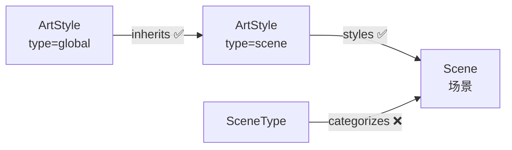

# 03 场景美术

> 场景的美术风格继承与分组。

---

## 风格继承链

```
ArtStyle[global] → inherits → ArtStyle[scene] → styles → Scene
```

---

## 节点

### 场景类型（SceneType）— 按需

> 非必须。仅在项目需要对场景进行分类（如室内/室外、城市/荒野）时使用。

场景的分组机制。拥有风格属性，在场景最终风格中作为 type=scene 的 ArtStyle 和 Scene 之间的可选覆盖层。

| 字段 | 中文 | 类型 | 必填 | 说明 |
|------|------|------|------|------|
| id | 编号 | string | 是 | `scenetype_001` |
| name | 名称 | string | 是 | `室内住宅` |
| description | 描述 | string | 否 | 类型说明 |
| lighting_direction | 光线方向 | string | 否 | |
| perspective | 透视/机位 | string | 否 | |
| color_direction | 色彩方向 | string | 否 | |

> ArtStyle 和 Scene 节点定义见 [01_叙事基础.md](01_叙事基础.md)（Scene）和 [02_角色美术.md](02_角色美术.md)（ArtStyle）。

---

## 边

> 所有边方向：**上游 → 下游**。`sync` 属性控制级联同步。

### inherits — 场景风格继承全局风格

- **方向**：`ArtStyle[type=global] → ArtStyle[type=scene]`

| 属性 | 中文 | 类型 | 必填 | 说明 |
|------|------|------|------|------|
| override_fields | 覆盖字段 | string | 否 | 逗号分隔的被覆盖字段名列表 |
| sync | 同步 | boolean | 否 | 默认 `true` |

---

### styles — 风格应用于场景

- **方向**：`ArtStyle[type=scene] → Scene`

| 属性 | 中文 | 类型 | 必填 | 说明 |
|------|------|------|------|------|
| sync | 同步 | boolean | 否 | 默认 `true` |

---

### categorizes — 类型包含场景（按需）

- **方向**：`SceneType → Scene`

| 属性 | 中文 | 类型 | 必填 | 说明 |
|------|------|------|------|------|
| sync | 同步 | boolean | 否 | 默认 `false` |

---

## 结构图



---

## ID 规则

| 节点 | 前缀 | 格式 | 示例 |
|------|------|------|------|
| 美术风格 | `style_` | `style_NNN` | `style_003`（scene） |
| 场景类型 | `scenetype_` | `scenetype_NNN` | `scenetype_001` |

---

## 方向验证

| from | 允许的边 | to |
|------|---------|-----|
| ArtStyle[type=global] | inherits | ArtStyle[scene] |
| ArtStyle[type=scene] | styles | Scene |
| SceneType | categorizes | Scene |
