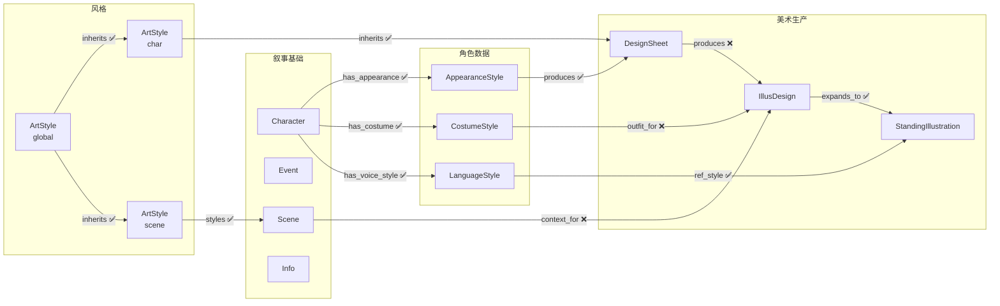

# 他者之镜 Schema 总览

> Schema 按模块拆分，渐进式披露。每个文件自包含节点定义、边定义、ID 规则。

---

## 全局规则

**边方向原则**：所有边方向统一为 **上游（被继承者/源头）→ 下游（继承者/消费者）**。

**同步机制**：每条边都有 `sync` 属性（boolean）。当上游节点更新时，所有 `sync=true` 的出边指向的下游节点自动标记为"待修改"。同步沿边方向级联传播。

---

## 模块索引

| 文件 | 内容 | 核心节点 |
|------|------|---------|
| [01_叙事基础.md](01_叙事基础.md) | 角色是谁、做了什么、在哪里、知道什么 | Character, Event, Scene, Info |
| [02_角色美术.md](02_角色美术.md) | 角色如何从文字变成画面 | ArtStyle, AppearanceStyle, CostumeStyle, LanguageStyle, DesignSheet, IllusDesign, StandingIllustration |
| [03_场景美术.md](03_场景美术.md) | 场景如何渲染 | SceneType（按需） |
| [04_剧情.md](04_剧情.md) | 剧情节奏、分支、条件 | 待补充 |

---

## 全节点速查

| 节点 | ID 前缀 | 一句话说明 |
|------|--------|-----------|
| Character | `char_NNN` | 有名字的人物 |
| Event | `evt_NNN` | 某时某刻发生的某件事 |
| Scene | `scene_NNN` | 具体地点/游戏场景 |
| Info | `info_NNN` | 一条有意义的认知碎片 |
| LanguageStyle | `voice_NNN` | 角色说话方式、语气、口头禅 |
| ArtStyle | `style_NNN` | 画风/渲染参数，type 区分 global / char / scene |
| AppearanceStyle | `appearance_NNN` | 角色固定外貌（脸、体型、发色） |
| CostumeStyle | `costume_NNN` | 角色默认着装（衣物、配饰） |
| DesignSheet | `design_NNN` | 角色三视图设计稿 |
| IllusDesign | `illus_NNN` | 场景适配立绘设计图 |
| StandingIllustration | `stand_NNN` | 具体表情/动作的单张立绘 |
| Faction | `faction_NNN` | 角色分组（按需） |
| SceneType | `scenetype_NNN` | 场景分类（按需） |

---

## 全局边速查

| 边 | 从 → 到 | sync | 说明 |
|----|---------|------|------|
| **叙事基础** | | | |
| relation | Character → Character | ❌ | 人物关系 |
| involved | Character → Event | ❌ | 人物参与事件 |
| occurred_at | Event → Scene | ❌ | 事件发生地点 |
| at | Character → Scene | ❌ | 人物—场景 |
| link | Character/Event/Scene → Info | ❌ | 信息关联（仅 3 大实体） |
| evt_relation | Event → Event | ❌ | 事件因果/时序 |
| **角色美术** | | | |
| inherits | ArtStyle[global] → ArtStyle[char] | ✅ | 角色风格继承全局 |
| inherits | ArtStyle[char] → DesignSheet | ✅ | 设计图继承角色风格 |
| has_appearance | Character → AppearanceStyle | ✅ | 角色外貌 |
| has_costume | Character → CostumeStyle | ✅ | 角色着装 |
| has_voice_style | Character → LanguageStyle | ✅ | 角色语言风格 |
| produces | AppearanceStyle → DesignSheet | ✅ | 外貌产出设计图 |
| produces | DesignSheet → IllusDesign | ❌ | 设计图→立绘设计图 |
| outfit_for | CostumeStyle → IllusDesign | ❌ | 着装→立绘设计图 |
| context_for | Scene → IllusDesign | ❌ | 场景→立绘设计图 |
| expands_to | IllusDesign → StandingIllustration | ✅ | 拓展表情/动作变体 |
| ref_style | LanguageStyle → StandingIllustration | ✅ | 语言风格→立绘参考 |
| groups | Faction → Character | ❌ | 阵营包含角色（按需） |
| **场景美术** | | | |
| inherits | ArtStyle[global] → ArtStyle[scene] | ✅ | 场景风格继承全局 |
| styles | ArtStyle[scene] → Scene | ✅ | 风格应用于场景 |
| categorizes | SceneType → Scene | ❌ | 类型包含场景（按需） |

---

## 全局结构图

